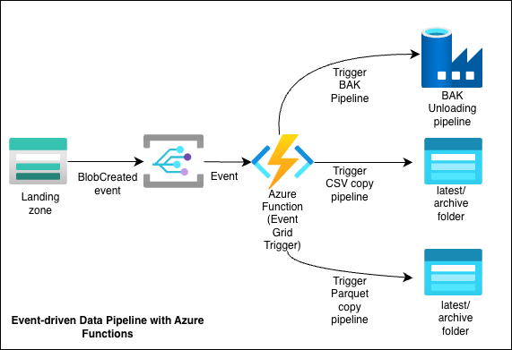

# Azure Function for triggering Azure Data Factory when a new file is uploaded
Author: David Salac, Nafisah Badmos, University of Liverpool

## Purpose
This Azure Function App consists of multiple Azure Functions that process files when they land in Blob Storage. The files could be CSV, Apache Parquet or SQL BAK files. Depending on the type of file, the right function is triggered to perform the task of either copying files to the right destination or trigger an ADF pipeline.

## Architecture

## Architecture

* Event-driven(no manual triggering)
* Uses app registration
* Handles csv, parquet files and ADF pipeline
* Designed for healthcare-style EL scenarios but adaptable to any sector

## Quickstart

Prereqs:
- Azure subscription
- ADF instance
- Storage Accounts
- Python 3.12
- Azure Function App
- VS Code Azure Functions extension

## How to deploy the Azure Function
1. Create a `Function App` in Azure using the `Flex Consumption` plan.
    1. Deploy it within its own Storage Account using default values.
    2. Use Python 3.12 as the programming language.
2. Install the VS Code extension for working with Azure Functions.  
   Follow the guide: [Develop Azure Functions using Visual Studio Code](https://learn.microsoft.com/en-us/azure/azure-functions/functions-develop-vs-code?tabs=node-v4%2Cpython-v2%2Cisolated-process%2Cquick-create&pivots=programming-language-python)
3. In VS Code, press `F1`, run `Azure Function: Create New Project`, and follow the prompts.
4. Remember to deploy the function to a separate container, not where the data are located.
5. The type of Azure Function should be `Event Grid`.
6. Deploy using `F1` -> `Azure Function: Deploy to Function App`.
7. Enable Managed Identity (if this is the preferred method of authorization).
8. Configure all required environment variables (go to Settings > Environment variables):

## Environment Variables
Environment variables are set within the Azure Function (in the `Settings` section).

Shared values for the App Registration:
1. `CONTAINER_TENANT_ID`: Tenant UUID where the App Registration is created.
2. `CONTAINER_CLIENT_ID`: App Registration Client (App) ID.
3. `CONTAINER_CLIENT_SECRET`: App Registration secret.

### For LCC and Alder Hey pipelines (EL pipelines)
Below `<ORIGIN>` refers to either `LCC` or `ALDER_HEY`. `<ORDER>` is a relative
position of the destination location, starting with `0` and potentially up to `19`.

1. `<ORIGIN>_<ORDER>_DESTINATION_FOLDER`: Path within the destination container (where data are copied). Usually just `latest`.
2. `<ORIGIN>_<ORDER>_DESTINATION_ARCHIVE_FOLDER` _(Optional)_: Path to the archive folder within the destination container. Usually just `archive`, which is the default value.
3. `<ORIGIN>_<ORDER>_DESTINATION_STORAGE_ACCOUNT`: Destination Storage Account.
4. `<ORIGIN>_SOURCE_STORAGE_ACCOUNT`: Storage Account name of the data source.
5. `<ORIGIN>_SOURCE_CONTAINER`: Container name of the data source.

### Environment Variables for distribution of zipped BAK file
The purpose of this pipeline is to trigger the Azure Data Factory (ADF) pipeline.

1. `SF_BAK_CONTAINER`: Name of the container within the Storage Account where the zip file is located.
2. `SF_BAK_ADF_SUBSCRIPTION`: Subscription UUID where Azure Data Factory (ADF) is located.
3. `SF_BAK_ADF_RESOURCE_GROUP`: Resource Group where Azure Data Factory (ADF) is located.
4. `SF_BAK_ADF_NAME`: Name of the Azure Data Factory (resource name).
5. `SF_BAK_ADF_PIPELINE_NAME`: Name of the pipeline within Azure Data Factory.

### Environment Variables for copying Parquet files
To clarify: an Apache Parquet **file** created by Apache Spark is represented by a **folder** (which can contain one or many actual files with the `.parquet` extension), therefore the whole folder needs to be copied.

1. `QX_PARQUET_FOR_SF_SOURCE_STORAGE_ACCOUNT`: Name of the Storage Account where Apache Parquet file(s)/folder(s) are located.
2. `QX_PARQUET_FOR_SF_SOURCE_CONTAINER`: Name of the container within the Storage Account where the Apache Parquet file(s)/folder(s) are located.
3. `QX_PARQUET_FOR_SF_SOURCE_FOLDER_PATH`: Relative path within the container where the Apache Parquet file(s)/folder(s) are located.
4. `QX_PARQUET_FOR_SF_DESTINATION_ARCHIVE` _(Optional)_: Name of the folder to be created in the destination location for the archive.
5. `QX_PARQUET_FOR_SF_DESTINATION_LATEST` _(Optional)_: Name of the folder to be created in the destination location for the latest Apache Parquet files/folders.
6. `QX_PARQUET_FOR_SF_DESTINATION_URLS`: Vertical bar-separated list of all destination location URLs — all must be Storage Account locations following the pattern:  
   `https://<STORAGE-ACCOUNT>.blob.core.windows.net/<CONTAINER>/<RELATIVE-PATH>`.

## How to link with the Storage Account
1. Go to the Storage Account where data are uploaded (landing zone).
2. Open the `Events` tab, add a new `Event Subscription`, and link the event (`Blob Created`) with the function.
3. Set up all necessary filters. The logic of *Subject Begins With* follows:  
    `/blobServices/default/containers/<container-name>/blobs/<path-to-blob>`
4. Make sure that the correct Azure Function is selected.
5. In the Networking tab, add a Resource instance exception by setting the
    resource type to `Microsoft.EventGrid/systemTopics` and the instance name to the
    instance created above, or apply it to the whole subscription.

## How to sort out networking and authentication
1. Assign the `Data Factory Contributor` role to the function's App Registration at the Azure Data Factory (ADF) level.
2. Assign the `Storage Blob Data Contributor` role to the function's App Registration at the Storage Account level.
3. Add a Virtual Network (VNET) exception for the function's VNET within all related Storage Account containers.

## My Contribution

- Implemented the Azure Function logic in Python
- Configured Event Grid → Function → ADF pipeline trigger
- Set up env vars, RBAC (Data Factory Contributor, Storage Blob Data Contributor) and networking configuration
- Documented deployment steps for repeatable use